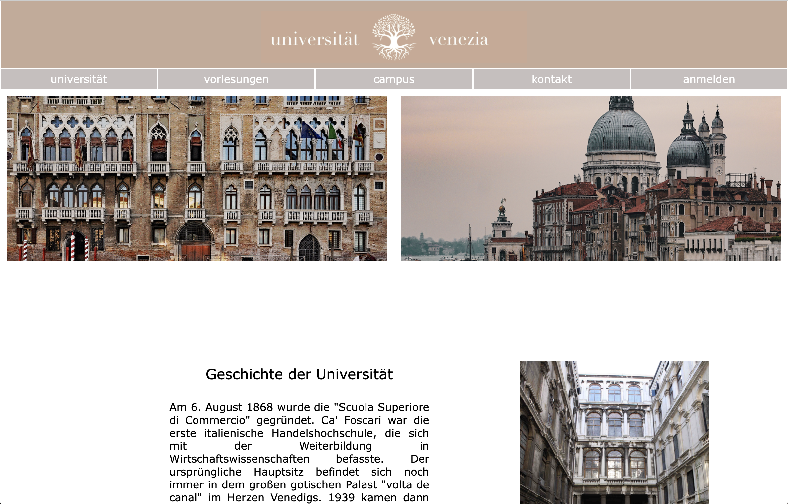
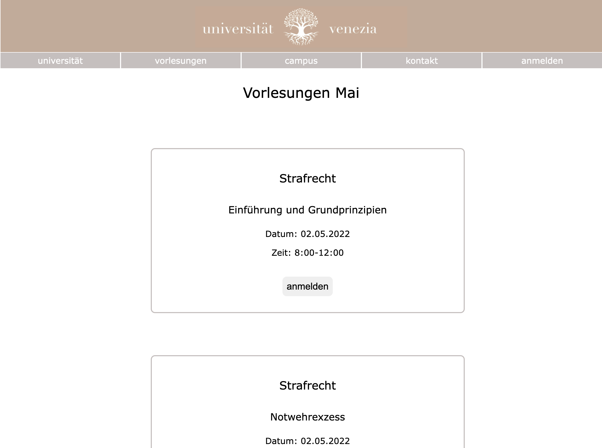
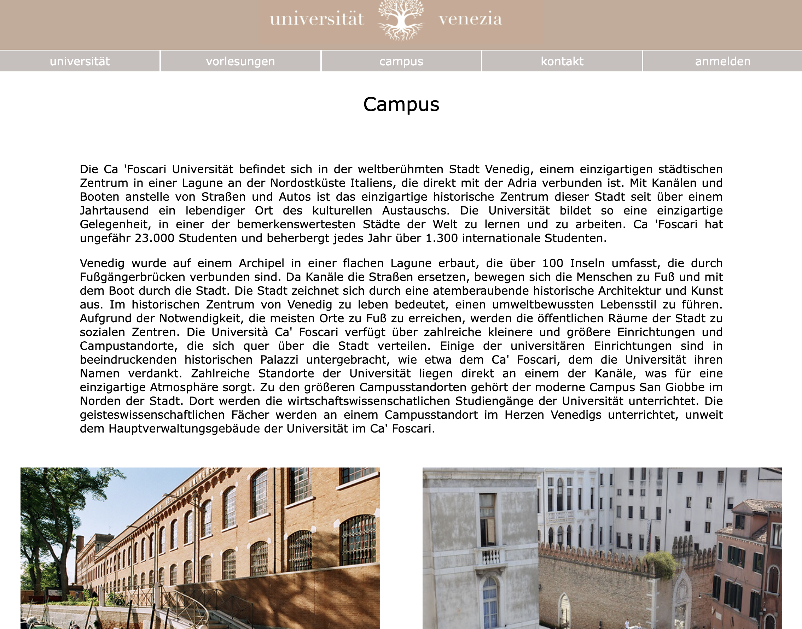
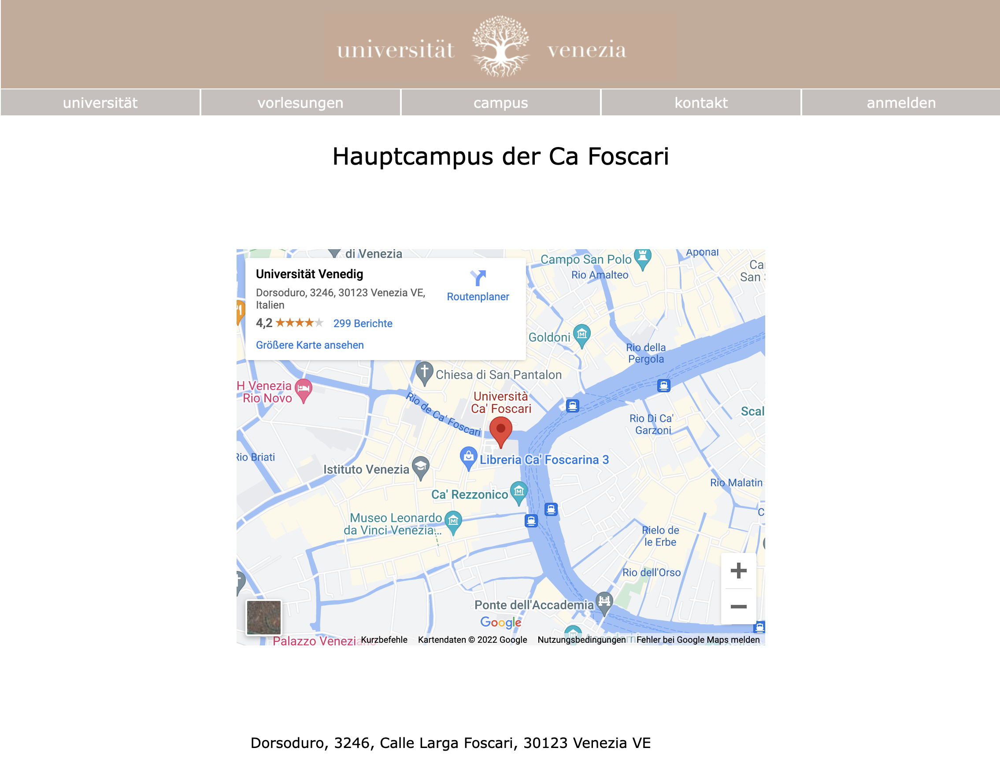
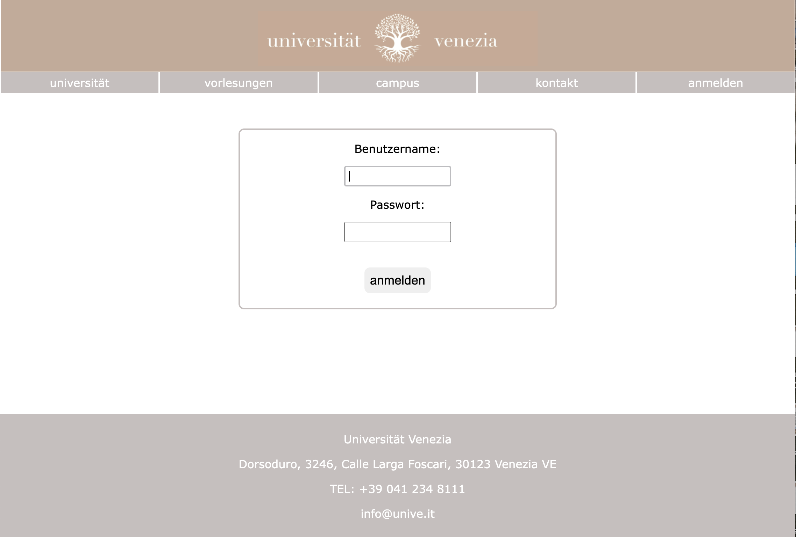
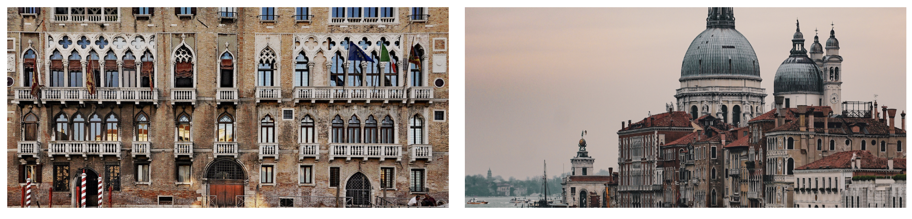

# universität venezia

Für unser Projekt eine Konferenzwebsite zu programmieren haben wir die Universität Venezia ausgesucht. Dafür haben wir eine Website der Universität programmiert, dort stehen sämtliche Informationen zur Universität. Auf verschiedenen Unterseiten kann man sämliche Informationen herausfinden. Ausserdem können sich studierende dort für unterschiedliche Kurse anmelden. 
Die Idee dieses Projektes kam dadurch zustande, dass wir beide sehr gerne für eine Zeit im Ausland studieren würden. Uns ist aufgefallen, dass bei der Auswahl einer Universität deren Website eine grosse Rolle spielt. Deshalb haben wir es uns als Aufgabe gestellt eine ansprechende Website für die Universiät Venezia zu gestalten.

## Projektplan

Auf jeder Unterseite unserer Website befindet sich ein header mit dem Logo der Universität und ein footer mit den wichtigsten Daten. Ausserdem hat man mithilfe des Menus Zugang zu jeder Unterseite und auch eine Anmeldeoption für Studiernede. Als Grundlage unserer Website diente unsere alte Website einer Praxis.

Einserseits war es uns wichtig eine funktionierende und ansprechend gestaltete Website zu Programmieren, andererseits sollten Stundierende eine Anmeldemöglichkeit haben. Unsere Idee war es ein Anmeldebutton/Abmeldebutton zu programmieren. Sobald man angemeldet ist, hat man die Möglichkeit sich für unterschiedliche Kurse anzumelden.  

### Hauptseite - universität

Auf der Hauptseite war es für uns in erster Linie wichtig, dass neue Studenten und Studentinnen durch unsere Website gefallen an der Universität finden und dort eventuell studieren werden. Deshalb war uns eine einfache und übersichtliche Gliederung wichtig, damit man schnell zu den wichtigsten Informatinen gelant. Wir haben uns auch entschieden die News auf die Hauptseite zu nehmen damit sie für jeden schnell ersichtlich sind. Auch war uns die Geschichte und Lage der Universität wichtig, daher haben wir darüber auch kurze texte geschrieben 

### Unterseite 1 - Vorlesungen

Hier können sie unsere Studenten und Studentinnen für verschiedenste Vorlesungen anmelden. Jedoch auch abmelden, wenn man nicht teilnehmen kann.

### Unterseite 2 - Campus

Auf der zweiten Unterseite wollten wir den Campus vorstellen. Um ihn von verschiedenen Perspektiven zeigen zu können haben wir einerseits einen Text verfasstr aber auch zwei schöne Bilder ausgewählt.

### Unterseite 3 - Kontakt

Auf der Kontaktseite wollten wir zuerst Telefonnummer und Emailadresse notieren. Nach kurzem Überlegen haben wir uns aber dazu entschieden die Daten in den footer zu schreiben, da sie so von jeder Seite direkt sichtbar sind. 

Als Karte haben wir eine Interaktive Karte verwendet. Man kann herein- oder herauszoomen, so ist die Lage der Universität gut ersichtlich.

### Unterseite 4 - Anmeldeoption

Hier können sich alle Studierenden der Universität mit ihrem Benutzerkonto anmelden. Dies ist notwendig, damit sie sich später auch für die vorlesungen anmelden können und so ihren individuellen Anmeldestatus überprüfen können.
## Zeitplan

| Deadline | Name | Beschreibung |
| --- | --- | --- |
| KW 42/43 2021 | Anna Bühler und Mia Hollenstein | Thema der Website ausgewählt, Projektplanung begonnen|
| KW 44/45 2021 | Anna Bühler und Mia Hollenstein| Zeitplan geschrieben, einfache und erweiterte Version|
| KW 46/47 2021 | Anna Bühler und Mia Hollenstein | Planung des Aufbaus der Website, welche Universität|
| KW 48/50 2021 |  Anna Bühler und Mia Hollenstein| erste Skizzen der Website, header und footer gemacht, Logo gestaltet, Titel der Website|
| KW 50/51 2021 | Anna Bühler |Menu mit hover- Effekt, Anwendung flex-Box, Formatierungen der Unterseiten |
| KW 52/1 2021 | Mia Hollenstein | Text für universität Seite und campus geschrieben, begonnen mit der Bilderwahl|
| KW 2/3 2021 | Anna Bühler und Mia Hollenstein | Texte überarbeitet, neue ideensammlung, struktur angelegt|
| KW 4/5 2021 | Anna Bühler Mia Hollenstein| Dokumentation begonnen, Projektplanung überarbeitet
| KW 6/7 2021 | Mia Hollenstein | ReadMe begonnen |
| KW 8/9 2021 | Anna Bühler und Mia Hollenstein | Website begonnen zu programmieren, alles bisherige zusammenfügen|
| KW 10/11 2021| Anna Bühler und Mia Hollenstein| Website formatiert, farben angepasst, Website fertig programmiert mit anmeldefunktion|
| KW 12/13 2021| Anna Bühler und Mia Hollenstein| Dokumentation weitergeschrieben|
| KW 14/15 2021| Anna Bühler und Mia Hollenstein| Website, Dokumentation, ReadMe fertiggestellt |

## Umsetzung
Da wir von Anfang an wussten, dass alle Seiten gleich aufgebaut werden, haben wir für alle Bilder und Text einen Kontainer erstellt.  Dort haben wir auch zum Beispiel margin und justify-content und die buttons definiert. Ausserdem haben wir verschiedene Titelarten definiert. Auch die grössen der Bilder haben wir einheitlich zugeschnitten.
Das Logo der Universität, welches auf jeder Seite im Banner zu finden ist, haben wir selbst entworfen und designt. Unsere Website haben wir in ählichen Farben gehalten, passend zum Campus. Ausserdem haben wir eine Anmeldeoption für Studierende die sich dadurch für Vorlesungen individuell anmelden können.

### Hauptseite - home

Die oben zu sehenden Bilder passen sich der Fenstergrösse an. Dafür haben wir eine flex-Box erstellt und `justify-content: strech;` verwendet. Für unser Angebot und die News haben wir die oben erwähnten Kontainer (flex-Boxen) verwendet. Im Text zum Angebot erfährt man eine kleine Zusammenfassung über die Dienstleitungen unserer Praxis. Das Bild fanden wir sehr passend, da in dieser Auslage die Angebote der Lektüren in unserem Wartebereich zu sehen sind. Da unserer Praxis gerade umgezogen ist haben wir uns entschieden ein Bild unseres neuen Standortes zu wählen, da dies der Inhalt unserer News ist.

---------

### Unterseite 1 - praxis

Auf der ersten Unterseite stellen wir unsere Behandlungszimmer vor. Die Bilder sollen einladend wirken und zusammen mit dem Text aber auch informativ sein. Im Text zum juristischen Büro erwähnen wir das Anwaltsgeheimnis und gehen auf die Arbeit unserer Anwältin (Mia Hollenstein) ein. Im Text zum medizinischen Behandlungszimmer gehen wir auf die Arbeit unserer Rechtsmedizinerin (Anna Bühler) ein. 

### Unterseite 2 - team

Auf der dritten Unterseite stellen wir das Praxisteam vor. Jedes Praxismitglied wird durch eine kurze Beschreibung vorgestellt und einem Bild. In der Beschreibung sind unsere Ausbildungen, sowie Weiterbildungen und Kompetenzen zu finden. Dazu haben wir recherchiert und passende Angaben verwendet. Diese haben wir dann, für eine gute Übersicht, mit Stichpunkten untereinander geschrieben. 

### Unterseite 3 - kontakt

Auf der letzten Unterseite haben wir uns überlegt eine interaktive Karte zu verwenden die direkt zu unserem Standort führt. Dafür haben wir auf Google Maps den Link kopiert und eingefügt. Ausserdem stehen unsere Öffnungszeiten, welche wir im html Dokument mithilfe einer Tabelle formatiert haben, auf der dritten Unterseite.

## Zusammenfassung

Schlussendlich stimmen Skizze und Endergebnis sehr gut überein. Jedoch haben wir uns bei der Planung auch schon Gedanken gemacht welche man gut umsetzen konnte, sodass wir später nicht auf allzu grosse Probleme treffen. Der Zeitplan wurde während des programmierens nicht direkt eingehalten, da wir gemerkt haben das wir zuerst die Website programmieren müssen bevor wir richtig mit dem readme starten konnten. Zeitlich ist es dann schlussendlich aber doch sehr gut aufgegangen. 